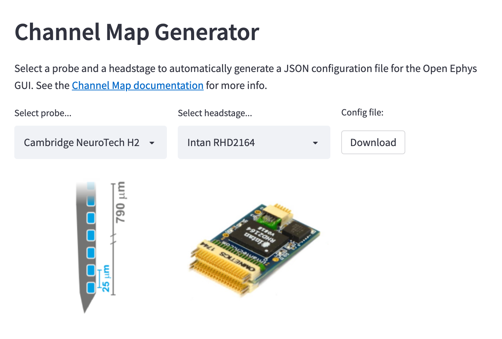

This is a [`streamlit`](https://streamlit.io/) app that allows users to select a probe and a headstage, and download
the associated configuration file for the Open Ephys GUI's Channel Map plugin.

It relies on the [`probeinterface`](https://github.com/SpikeInterface/probeinterface) library for auto-generating
the channel map.

## Usage

The app is running at https://share.streamlit.io/jsiegle/channel-map-generator/main/channel_map_generator.py

**Important note:** The current implementation just downloads a placeholder JSON file; more work is needed to make it fully functional.

## Development

The app only has two dependencies, `streamlit` and `probeinterface`.

To run it locally, create a virtual environment using `pipenv`, `conda`, etc., and make sure these two packages are installed.

Then, simply enter:

```
streamlit run channel_map_generator.py
```

and the app will open in a browser.

One of the awesome things about `streamlit` is that the app will automatically update whenever the source code
is changed. So simply saving `channel_map_generator.py` will trigger the app to reload.
